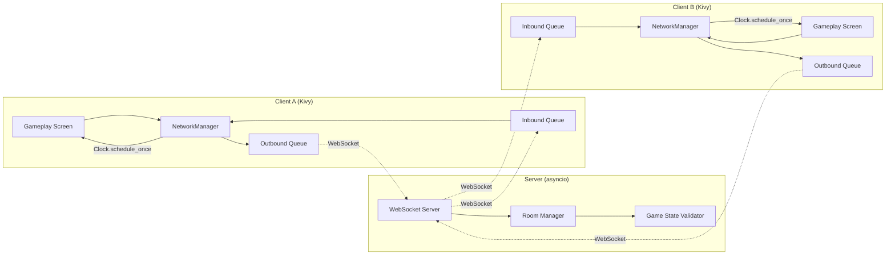
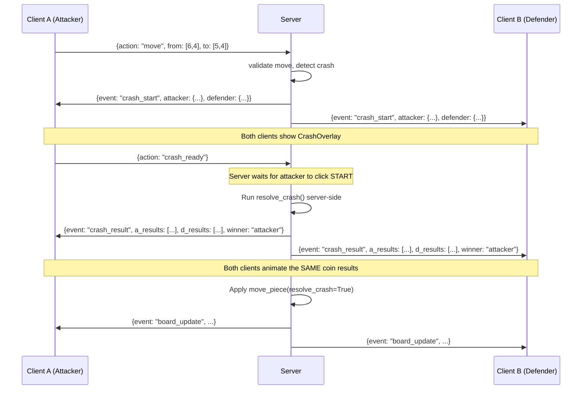

# Online Multiplayer Architecture Plan

## Codebase Analysis Summary

The current architecture is a **monolithic local-first design** where all game state, move validation, crash resolution, and UI rendering live in one process. The key systems are:

| System | Files | Coupling Level |
|---|---|---|
| Board & Rules | `logic/board.py`, `logic/pieces.py` | ✅ Clean — pure logic, no UI imports |
| Crash (Coin Toss) | `logic/crash_logic.py` | ✅ Clean — pure math, RNG-based |
| AI Controller | `logic/ai_controller.py` | ⚠️ Imports `kivy.clock`, references `screen` directly |
| Map Effects | `logic/maps/*.py` | ✅ Clean — inherits from `ChessBoard` |
| Gameplay Screen | `screens/gameplay_screen.py` (835 lines) | 🔴 **Monolith** — handles input, rendering, crash flow, timer, promotion, items, AI delegation |
| Crash Overlay | `components/crash_overlay.py` | ⚠️ Runs its own RNG locally, animates, then calls back |
| Match Setup | `screens/match_setup/` | ✅ Low impact — just config selection |
| Sidebar & UI | `components/sidebar_ui.py`, `chess_square.py` | ✅ Low impact — pure display |

---

## 1. Recommended Tech Stack

### Server

| Choice | Rationale |
|---|---|
| **`asyncio` + `websockets`** (Python) | Same language as the client. WebSockets provide full-duplex, low-latency messaging. `asyncio` handles many concurrent rooms without threads. |
| **JSON messages** | Human-readable, easy to debug. Game messages are small (< 1KB), so serialization overhead is negligible. |
| **No framework** (no Django/Flask) | The server is a stateful game relay/validator, not a REST API. A lightweight `websockets.serve()` loop is sufficient. |

```
pip install websockets
```

### Client (Kivy Side)

| Choice | Rationale |
|---|---|
| **`threading.Thread`** for the WebSocket listener | Kivy's main thread must never block. A dedicated daemon thread runs `asyncio.run()` for the WebSocket connection. |
| **`Clock.schedule_once()`** to push received messages to UI | Thread-safe bridge: the network thread puts messages in a `queue.Queue`, and a Kivy `Clock` interval polls and dispatches them. |
| **`queue.Queue`** for thread communication | Avoids race conditions. Outbound messages also go through a queue consumed by the network thread. |

### Architecture Diagram



---

## 2. Source of Truth: Authoritative Server

> [!IMPORTANT]
> The server **MUST be authoritative** (validate all moves), not just a relay. This is critical for a competitive game with RNG elements.

### Why Not a Simple Relay?

| Concern | Relay Risk | Authoritative Solution |
|---|---|---|
| **Cheating** | Client sends fake "I won the crash" | Server runs `crash_logic.resolve_crash()` and broadcasts the canonical result |
| **Desync** | Two clients compute different RNG outcomes | Server is the single RNG source; clients just animate the result |
| **Timer abuse** | Client lies about timeout | Server tracks turn timers independently |
| **Move validation** | Client sends illegal moves | Server runs `board.get_legal_moves()` before applying |

### Server Responsibilities

1. **Maintain the canonical `ChessBoard` instance** for each active game room
2. **Validate every move** via `get_legal_moves()` before applying
3. **Run all crash RNG** via `crash_logic.py` — send results to both clients
4. **Track turn timers** — enforce timeout game-over from server side
5. **Broadcast state diffs** — not full board state, just `{action, from, to, result}`

### Client Responsibilities

1. **Render** the board based on server messages
2. **Animate** crashes using server-provided coin results
3. **Send user input** (selected square, crash "START" click, promotion choice, item usage)
4. **Optimistic display** (optional) — show piece selection/highlights locally, but never apply moves until server confirms

---

## 3. Handling Complex Events Over the Network

### 3.1 Crash (Coin Toss) Resolution

This is the hardest sync challenge. The current flow is:

```
Local: tap square → move_piece() returns "crash" → show CrashOverlay →
       user clicks START → local RNG runs → animation plays → callback executes move
```

**Networked flow:**



> [!TIP]
> The key insight: `CrashOverlay.start_crash_animation()` currently generates random results locally. In multiplayer, it must instead **receive** the results array from the server and **animate** them deterministically.

**Required refactor for `crash_overlay.py`:**
- Add a `set_results(a_results, d_results, a_total, d_total)` method
- `start_crash_animation()` checks: if results are pre-set (multiplayer), use them; otherwise, generate locally (singleplayer)
- This keeps backward compatibility with PVE/campaign

### 3.2 Turn Timer Sync

```
Server: starts timer on turn change → ticks internally →
        broadcasts {event: "timer_sync", remaining: N} every 5s →
        on timeout: {event: "game_over", reason: "timeout", loser: "white"}
```

- Client timer is cosmetic — it runs locally for smooth display
- Server periodically sends sync pulses to correct drift
- Server is the authoritative timeout trigger

### 3.3 Pawn Promotion

```
Server detects promotion → sends {event: "promotion_required", pos: [0,4]} →
Client shows popup → user picks Queen →
Client sends {action: "promote", pos: [0,4], piece: "queen"} →
Server applies → broadcasts board_update
```

### 3.4 Item Usage

```
Client sends {action: "use_item", item_id: 6, target_pos: [5,3]} →
Server validates (correct turn, item exists in inventory, target valid) →
Server applies effect → broadcasts {event: "item_used", ...}
```

---

## 4. Refactoring Impact Analysis

### 🔴 HIGH IMPACT — Major Refactoring Required

#### [gameplay_screen.py](file:///c:/Users/User/Rogue-like-chess/screens/gameplay_screen.py) (835 lines)
The **single biggest refactoring target**. Currently a monolith that handles:
- Board rendering ✅ (keep as-is)
- Move input → `game.move_piece()` → direct state mutation 🔴 (must go through network)
- Crash overlay trigger and callback 🔴 (must split local vs network path)
- Turn timer management 🔴 (must defer to server in online mode)
- Promotion popup flow 🔴 (must send choice to server)
- Item usage 🔴 (must send to server)
- AI controller delegation ⚠️ (disable in online mode)

**Refactoring strategy:** Extract a `GameController` interface:

```python
class LocalGameController:
    """Current logic — direct board manipulation (PVE, campaign)"""
    def submit_move(self, sr, sc, er, ec): ...
    def submit_crash_ready(self): ...
    def submit_promotion(self, piece_class): ...
    
class OnlineGameController:
    """Sends actions to server, applies server responses"""
    def submit_move(self, sr, sc, er, ec): ...  # sends {action: "move"}
    def submit_crash_ready(self): ...            # sends {action: "crash_ready"}
    def submit_promotion(self, piece_class): ... # sends {action: "promote"}
    def on_server_message(self, msg): ...        # dispatches server events
```

`gameplay_screen.py` calls `self.controller.submit_move()` instead of `self.game.move_piece()` directly.

---

#### [crash_overlay.py](file:///c:/Users/User/Rogue-like-chess/components/crash_overlay.py) (254 lines)
- `start_crash_animation()` runs local RNG — needs a **dual-mode** path
- Must accept pre-computed results from server for deterministic animation
- The callback `on_finish(start_pos, end_pos, status)` stays the same

---

#### [ai_controller.py](file:///c:/Users/User/Rogue-like-chess/logic/ai_controller.py) (88 lines)
- Must be **completely disabled** in online PVP mode
- Currently imported by `gameplay_screen.py` — add a guard: `if mode == 'PVP_ONLINE': return`

---

### ⚠️ MEDIUM IMPACT — Minor Adaptation

| File | Change Needed |
|---|---|
| [board.py](file:///c:/Users/User/Rogue-like-chess/logic/board.py) | Add `to_dict()` / `from_dict()` serialization for network sync. Add `apply_move_from_server(move_data)` method. No logic changes. |
| [pieces.py](file:///c:/Users/User/Rogue-like-chess/logic/pieces.py) | Add `serialize()` method to `Piece` base class for network state transmission |
| [crash_logic.py](file:///c:/Users/User/Rogue-like-chess/logic/crash_logic.py) | No changes — server imports and runs this directly |
| [setup_screen.py](file:///c:/Users/User/Rogue-like-chess/screens/match_setup/setup_screen.py) | Add "Online PVP" match type, room code UI, connection flow |
| [setup_section.py](file:///c:/Users/User/Rogue-like-chess/screens/match_setup/setup_section.py) | Add online lobby cards alongside PVE/PVP |
| [main.py](file:///c:/Users/User/Rogue-like-chess/main.py) | Register `NetworkManager` as app-level singleton |

### ✅ LOW / NO IMPACT — No Changes Needed

| File | Reason |
|---|---|
| `sidebar_ui.py` | Pure display — receives data from `gameplay_screen` |
| `chess_square.py` | Pure display widget |
| `campaign_map_screen.py` | Campaign is offline-only |
| `campaign_popups.py` | Campaign-only |
| `maps/*.py` | Server will run these; clients just render |
| `item_logic.py`, `item_effects.py` | Server-side only; no client changes |
| `history_logic.py` | Server maintains history; client receives it |
| `tutorial_screen.py` | Offline-only |

---

## 5. Network Message Protocol

### Client → Server Messages

```json
{"action": "create_room", "settings": {"map": "Classic Board", "timer": 300, "tribe_white": "...", "tribe_black": "..."}}
{"action": "join_room", "room_code": "ABC123"}
{"action": "move", "from": [6, 4], "to": [5, 4]}
{"action": "crash_ready"}
{"action": "promote", "pos": [0, 4], "piece": "queen"}
{"action": "use_item", "item_id": 6, "target_pos": [5, 3]}
{"action": "undo_request"}
{"action": "resign"}
```

### Server → Client Messages

```json
{"event": "room_created", "room_code": "ABC123", "color": "white"}
{"event": "opponent_joined", "opponent_name": "Player2"}
{"event": "game_start", "board": [...], "your_color": "white", "settings": {...}}
{"event": "move_applied", "from": [6,4], "to": [5,4], "result": "ok"}
{"event": "crash_start", "attacker": {...}, "defender": {...}}
{"event": "crash_result", "a_results": ["Yellow Heads", "Tails", ...], "d_results": [...], "a_total": 12, "d_total": 8, "winner": "attacker"}
{"event": "board_update", "board": [...], "turn": "black", "last_move": [...]}
{"event": "promotion_required", "pos": [0, 4], "color": "white"}
{"event": "timer_sync", "remaining": 245}
{"event": "game_over", "result": "WHITE WINS (Time Out)", "reason": "timeout"}
{"event": "opponent_disconnected"}
{"event": "error", "message": "Illegal move"}
```

---

## 6. Implementation Roadmap

### Phase 1: Foundation — Game Controller Abstraction (Offline Refactor)
**Goal:** Decouple game logic from direct UI calls without changing any behavior.
**Duration estimate:** 3-4 days

- [ ] Create `controllers/local_controller.py` — wraps current direct `board.move_piece()` calls
- [ ] Create `controllers/base_controller.py` — abstract interface
- [ ] Refactor `gameplay_screen.py` → `on_square_tap()` calls `self.controller.submit_move()` instead of `self.game.move_piece()`
- [ ] Refactor `CrashOverlay` to accept optional pre-computed results
- [ ] Add `board.to_dict()` / `Piece.serialize()` methods
- [ ] **Verify:** All existing PVE/PVP/Campaign modes still work identically

> [!IMPORTANT]
> This phase changes ZERO game behavior. It's purely structural. All existing tests/gameplay must pass unchanged.

---

### Phase 2: Server Core — Room Management & Move Validation
**Goal:** Build a standalone Python WebSocket server that hosts game rooms.
**Duration estimate:** 4-5 days

- [ ] Create `server/` directory at project root
- [ ] `server/main.py` — `asyncio` + `websockets.serve()` entry point
- [ ] `server/room.py` — `GameRoom` class: holds `ChessBoard`, manages two player connections, validates moves
- [ ] `server/room_manager.py` — create/join rooms by code
- [ ] Server imports `logic/board.py`, `logic/crash_logic.py`, `logic/pieces.py` directly (shared code)
- [ ] Implement message handling: `move`, `crash_ready`, `promote`, `resign`
- [ ] Server-side turn timer with `asyncio.sleep()` countdown
- [ ] **Verify:** Can connect two `wscat` terminals and play a full game via JSON messages

---

### Phase 3: Client Networking — Connect & Play
**Goal:** Kivy client can connect to the server and play a real online game.
**Duration estimate:** 5-7 days

- [ ] Create `network/network_manager.py` — singleton managing WebSocket connection
  - Daemon thread running `asyncio.run()`
  - `queue.Queue` for inbound/outbound
  - `Clock.schedule_interval` polling inbound queue
- [ ] Create `controllers/online_controller.py` — implements `BaseController`, translates actions to server messages
- [ ] Add "Online PVP" to match setup → room create/join UI with code input
- [ ] Update `gameplay_screen.py`:
  - Use `OnlineGameController` when mode is online
  - Lock input during opponent's turn
  - Receive and apply `board_update` events
  - Receive `crash_result` and feed to `CrashOverlay`
- [ ] Handle disconnection gracefully (popup + return to menu)
- [ ] **Verify:** Two Kivy clients on the same LAN can play a full game

---

### Phase 4: Polish — Lobby, Reconnection, Edge Cases
**Goal:** Production-ready online experience.
**Duration estimate:** 3-5 days

- [ ] Lobby screen: show active rooms, create with settings, join by code
- [ ] Reconnection: server holds game state for 60s on disconnect, client can rejoin
- [ ] Spectator mode (optional): third connection in read-only mode
- [ ] Network error handling: retry logic, timeout popups, graceful degradation
- [ ] Undo request: both players must agree (confirm popup)
- [ ] Anti-cheat: rate limiting, move timing validation
- [ ] Map effects sync: server runs `apply_map_effects()`, broadcasts spawned obstacles
- [ ] Item drop sync: server runs `trigger_winner_item_drop()`, broadcasts inventory changes
- [ ] **Verify:** Stress test with poor network conditions (simulated latency/drops)

---

## Open Questions

> [!IMPORTANT]
> **Q1: Deployment Target** — Where will the server be hosted? A simple VPS with Python? Or do you want a containerized solution (Docker)? This affects Phase 2 setup.

> [!IMPORTANT]
> **Q2: Matchmaking** — Should Phase 4 include random matchmaking (queue system), or is room-code-only sufficient for your use case?

> [!IMPORTANT]
> **Q3: Board Viewpoint** — In local PVP, both players see from White's perspective. In online PVP, should Black's client automatically flip the board (render from Black's viewpoint)?

> [!WARNING]
> **Q4: Campaign Mode** — Should online multiplayer be limited to Classic Chess mode only, or should Divide & Conquer also be supported online? D&C has additional deployment phases and farming mechanics that add significant server complexity.

> [!NOTE]
> **Q5: Undo Move** — Undo is currently free in local play. In online PVP, should it be disabled entirely, or require opponent approval?
